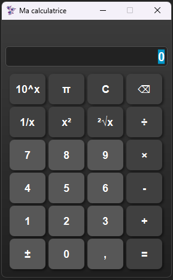

# JavaFX Calculator

A simple calculator application built with Java and JavaFX. This project was created to practice building graphical user interfaces and handling user events in Java.
## Requirements
Before you start, make sure you have the following components installed on your machine:
- Java JDK 17 or higher
- Maven (for dependency management and build)
- A compatible IDE (e.g., IntelliJ IDEA, Eclipse)

All dependencies, including JavaFX, are handled via the provided `pom.xml`. Make sure to open the project as a Maven project in your IDE to resolve everything correctly.
## How to Run
You can run the project either from your IDE or directly via the terminal using Maven.
### Option 1: Run from your IDE
- Open the project in your IDE (IntelliJ IDEA, Eclipse, etc.)
- Make sure it's imported as a Maven project
- Build the project (your IDE may do it automatically)
- Run the `Main.java` file

### Option 2: Run from the terminal
- Open a terminal in the project directory
- Run the following command to compile the project:

```bash
  mvn clean install
```

Then run the application using:

```bash
  mvn javafx:run
```

Make sure you have JavaFX properly configured in your `pom.xml` including the `javafx-maven-plugin`.
## Troubleshooting

### Error: JavaFX runtime components are missing
Make sure:
- You're using a Java version compatible with your JavaFX SDK
- You're launching the project using the `javafx:run` goal, not just `mvn run`
- The `javafx-maven-plugin` is correctly configured in your `pom.xml`

### Unable to resolve JavaFX modules
- Ensure you have an internet connection (Maven needs to download dependencies the first time)
- If you're behind a proxy, configure Maven accordingly in your settings.xml
- Try cleaning your local Maven cache:

```bash
  mvn clean
  mvn dependency:purge-local-repository
  mvn install
```

### Blank Window or No GUI
- Verify that your `start()` method in the `Application` class correctly sets and shows the primary stage
- Check if your `FXML` or CSS files are being loaded with the correct path (especially if using `getClass().getResource()`)
## Dependencies
The main dependencies used in this project (all handled via Maven):
- JavaFX – for the GUI components
- javafx-maven-plugin – to run the JavaFX app easily via Maven
## Preview


## Feedback

I value your feedback! If you have any suggestions, questions, or issues regarding the JavaFX Calculator, please feel free to reach out:

myriam.kuehn@free.fr

Your input helps improve the project and ensure a better user experience.
## License
This project is licensed under the MIT License.
See the LICENSE file for more details.